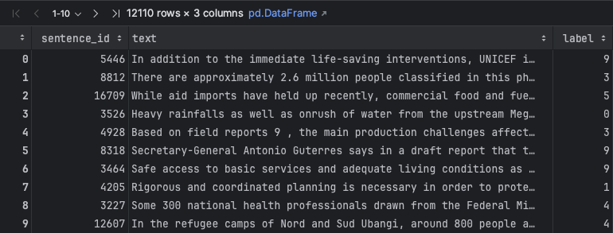
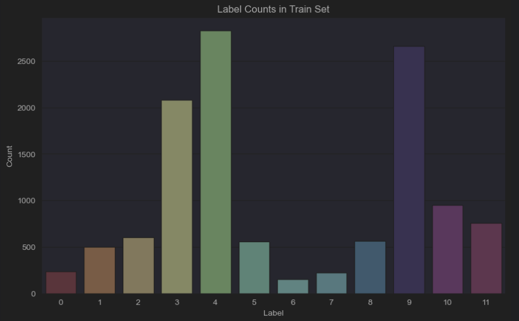
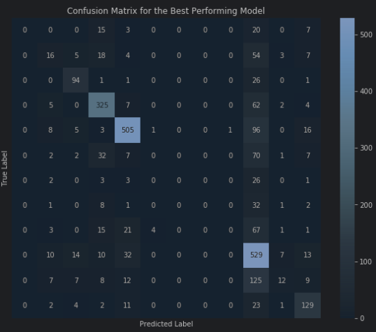
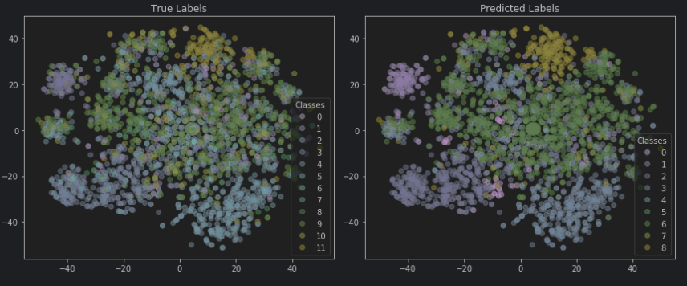

## General Information

# Netural Language Processing Project

**Disclaimer:** This is the final report of a university group project.
For a detailed project specification, look up the [Natural Language Processing page](https://www.jku.at/en/institute-of-computational-perception/teaching/alle-lehrveranstaltungen/natural-language-processing).

# Goal of the Project

The project aimed to practice the NLP theory by creating data-cleaning pipelines and
get to know the different techniques in the field, from essential Bag-of-Word representation to using LLMs.

# Dataset:

We use a subset of the `HumSet` dataset [1] (https://blog.thedeep.io/humset/) to conduct the experiments. `HumSet` is created by the DEEP (https://www.thedeep.io) project – an open-source platform that aims to facilitate the processing of textual data for international humanitarian response organizations.

[1] HumSet: Dataset of Multilingual Information Extraction and Classification for Humanitarian Crises Response
*Selim Fekih, Nicolo' Tamagnone, Benjamin Minixhofer, Ranjan Shrestha, Ximena Contla, Ewan Oglethorpe and Navid Rekabsaz.*
In Findings of the 2022 Conference on Empirical Methods in Natural Language Processing (Findings of EMNLP), December 2022.

Looks like this:

# 1. Assignment:

In our first assignment, we had to pre-process our dataset by applying various techniques:
* Converting text to lowercase
* Remove punctuation
* Tokenization
* Remove Stopwords
* Lemmatization

We created a Bag-of-Word representation and deleted all the words with less than 200 occurrences.

We created **sentence vectors** and implemented **TF-IDF** and **BM25** token weighting methods from scratch.

Then, we trained several models with the features from which the best was an SVM with TF-IDF weighting.

### See the initial results:

The most noticeable aspect of a suitable confusion matrix is the dominance of true positives along the diagonal, which is the case for some classes, such as the ones corresponding to 325, 505, and 529. This indicates that the model correctly classifies most instances for these classes. While the model performs well for some classes, there are clear indications of confusion between particular classes, possibly due to various factors, including class imbalance, overlapping feature distributions, or insufficient discriminative features.

In the 'True Labels' plot, we see distinct clusters corresponding to different classes, which suggests that classes are somewhat separable in the high-dimensional space. In the 'Predicted Labels' plot, clusters are also formed, but there are noticeable differences in cluster purity and size, which indicates how the model has classified the data points.
There are areas where the predicted labels closely match the actual labels, particularly in denser clusters. There are several points in the 'Predicted Labels' plot that are colored differently compared to the 'True Labels' plot.
It is notable that in the 'Predicted Labels' plot, there is no legend entry for classes 9, 10, and 11, which suggests that the model did not predict any instances of these classes, which may be an error, especially if these classes are present in the 'True Labels' plot.

